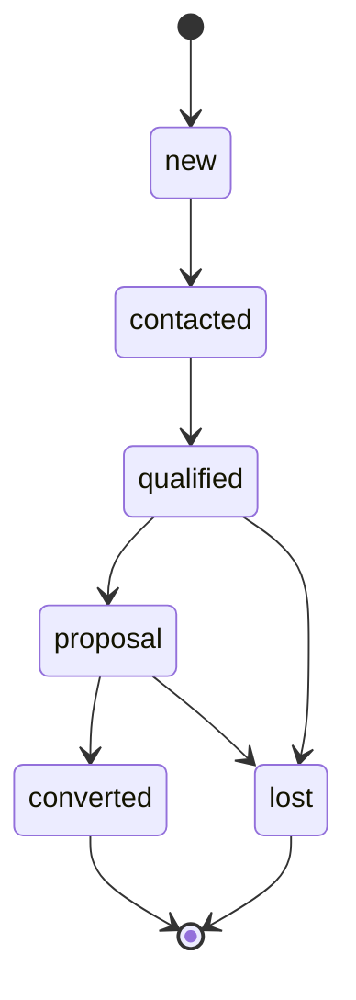

# Skill: State Machine Analysis

## Purpose

Analyze and document state machines for domain entities to ensure valid transitions and prevent invalid states.

## When to Activate

- When defining new status fields
- When status transition bugs occur
- During domain agent implementation
- For business rule documentation
- When onboarding new developers

## Execution Steps

### Step 1: Identify Stateful Entities

List all tables with status/state fields:
- `projects.status`
- `tasks.status`
- `leads.status`
- `invitations.status`
- etc.

### Step 2: Extract Current States

```sql
SELECT DISTINCT status, COUNT(*) as count
FROM {table}
GROUP BY status
ORDER BY count DESC;
```

### Step 3: Map Valid Transitions

Document observed or allowed transitions:
```
new → contacted: Allowed (first contact made)
new → qualified: Forbidden (must contact first)
contacted → qualified: Allowed (lead shows interest)
```

### Step 4: Identify Issues

- Orphan states (no path to reach)
- Sink states (no path out, unintended)
- Missing terminal states
- Impossible transitions in code

### Step 5: Generate Diagram



## Output Template

```markdown
# State Machine: {Entity}

## Overview

**Entity:** {table_name}
**Field:** {status_field}
**Total States:** X
**Terminal States:** Y

## States

| State | Description | Terminal? | Count |
|-------|-------------|-----------|-------|
| new | Initial state | No | 100 |
| converted | Successfully converted | Yes | 50 |

## Valid Transitions

| From | To | Trigger | Condition |
|------|-----|---------|-----------|
| new | contacted | User action | None |
| contacted | qualified | User action | Has email |

## Forbidden Transitions

| From | To | Reason |
|------|-----|--------|
| new | converted | Must go through process |
| lost | * | Terminal state |

## Diagram

{mermaid diagram}

## Issues Found

| Issue | Severity | Recommendation |
|-------|----------|----------------|
| {issue} | {level} | {action} |

## Code Enforcement

Location: {file_path}
Method: {validation_method}
```

## Templates by Entity

### Project Status
```
draft → active → on_hold → completed
                    ↓
                 cancelled
```

### Task Status
```
todo → in_progress → review → done
                       ↓
                    blocked
```

### Lead Status
```
(needs definition - see crm-agent.md)
```